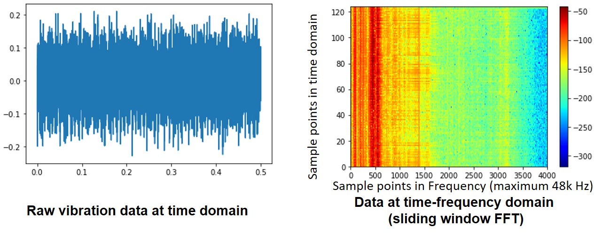

# Bearing Fault Detection using Unsupervised Machine Learning

Bearing fault is the major source of majority mechanical faults. For example, over 41% induction motor failures are caused by Bearing failure.[[source](https://www.sciencedirect.com/science/article/abs/pii/S095741581400004X#:~:text=The%20simplest%20frequency%2Ddomain%20analysis,generated%20by%20simultaneously%2Dactive%20equipment)] 

The simplest frequency-domain analysis method used for bearing fault detection is Fast-Fourier-Transform (FFT). The impact of vibration generated by a bearing fault has relatively low energy and it is often accompanied by high energy noise and vibration generated by simultaneously-active equipment. Therefore, it is difficult to identify the bearing fault in the spectra using conventional FFT methods. 

    
   
  Fig.1 Example of Bearing Fault Detection   

 

To overcome FFT problems, unsupervised Machine Learning can be a powerful tooling to detect the vital difference of the virbaition spectrum induced by bearing fault. In this post, I will focus on the unsupervised machine learning for bearing fault detections. The machine learning algorthms covered in this post are PCA, kernal-PCA, t-SNE and Autoencoders. We will first talk about the data used in this study.

# Dataset Preparing

## Data Source and Description
In this post we will use the bearing fault dataset from Case Western Reserve University Bearing Data Center. The Bearing virbation data is acquired at a sampling frequency of 48 kHz for the drive end bearing. The load is 1 hp and there are 10 classes need to be studied:

* C0  : Normal
* C1  : Ball defect (0.007 inch)
* C2  : Ball defect (0.014 inch)
* C3  : Ball defect (0.021 inch)
* C4  : Inner race fault (0.007 inch)
* C5  : Inner race fault (0.014 inch)
* C6  : Inner race fault (0.021 inch)
* C7  : Outer race fault (0.007 inch, data collected from 6 O'clock position)
* C8  : Outer race fault (0.014 inch, 6 O'clock)
* C9 : Outer race fault (0.021 inch, 6 O'clock)
One can check my [jupyternote book]("https://github.com/mrzhaojyi/Data-Driven-Anomaly-Detection/blob/main/notebooks/downloading_CWRU.ipynb") for more details on the Data Acquisition.

    
   
  Fig.2 Data download page of Bearing Data Center 
 <a href="https://engineering.case.edu/bearingdatacenter/download-data-file">[source]</a>

 

## Data Pre-processing using Sliding-window FFT
We conduct the sliding-window FFT transformation first for those data before the machine learning. Note the axias ticks represents the number of data points. X axis is the frequency and the maximum frequency is 48k Hz. Y axis is the time where the overlap ratio of the FFT sliding window is 0.01. Note the FFT size is 4000. So, it is a very high dimension dataset. One can check my jupyternote book for [more details]("https://github.com/mrzhaojyi/Data-Driven-Anomaly-Detection/blob/main/notebooks/load_saved_data_cleaned.ipynb").

    
   
  Fig.3 Transform Time Domain Vibration Signal to Time-Frequency Domain   

 

Once we complete sliding-window FFT for all the 10 classes and also normalize them into 0-1, we have our input data for this stduy as shown in Fig. 4.

    
   
  Fig.4 Bearing Fault Data for the 10 Classes (c0 - c9)   

 

Note the following analysis can be found in [my notebook](https://github.com/mrzhaojyi/Data-Driven-Anomaly-Detection/blob/main/notebooks/unsupervised_ML.ipynb).

# Principal Component Analysis (PCA)

Principal Component Analysis (PCA) is one of the most popular dimensionality reduction techniques used in machine learning. PCA transforms a large set of variables into a smaller one that still contains most of the information in the large set. The dimension reduction using PCA is shown as below:

    
   
  Fig.5 Results of PCA Cluster   

 
From the Fig.4, it can be seen PCA can segregate different classes to certain degree. However, some classes are still mixed together. For example, 'Outer race 0.007 inch' are right inside the 'Outer race 0.021 inch'. Let's move to the next algorithm.

# Kernel Principal Component Analysis (KPCA)

Kernel principal component analysis (kernel PCA) is an extension of principal component analysis (PCA) using techniques of kernel methods. Using a kernel, the originally linear operations of PCA are performed in a reproducing kernel Hilbert space.

    
   
  Fig.6 Results of KPCA Cluster   

 

This result is slightly better than previous ones and no overlap of classes was observed. However, it is still not good enough since the clusters are still very close to each other. Next, we will try the t-distributed stochastic neighbor embedding (t-SNE).

# t-distributed Stochastic Neighbor Embedding (t-SNE)

t-distributed stochastic neighbor embedding (t-SNE) is a statistical method for visualizing high-dimensional data by giving each datapoint a location in a two or three-dimensional map. It is based on Stochastic Neighbor Embedding originally developed by Sam Roweis and Geoffrey Hinton, where Laurens van der Maaten proposed the t-distributed variant. Note the t-SNE does not learn distribution function from the given data, so it is usually used for visualization-only.

    
   
  Fig.7 Results of t-SNE Cluster  

 
t-SNE gives incredible better result as compared to PCA and KPCA. However, since the t-SNE does not learn distribution function from the given data, so it is usually used for visualization-only. Thus, it is difficult to consider t-SNE as an unsupervised machine learning to Bearing Fault.

Until now, we have covered PCA, KPCA, t-SNE. There are still many different techniques for dimensionality reduction, like Multidimensional scaling (MDS), Isomap, Locally Linear Embedding (LLE). However, the author would like to jump into the next candidate, Autoencoder, which is belong to the Neural Network faimily.

# AutoEncoder (AE): Neural network with bottleneck

Autoencoders are an unsupervised learning technique where we apply neural networks for the task of representation learning. The Autoencoders we implemented here is one of the simplest Autoencoders, which is usually called as undercomplete autoencoder. It constrain the number of nodes present in the hidden layer(s) of the network, limiting the amount of information that can flow through the network. The cost function of this autoencoder is the difference between the input data and output data. The AE structure can be described using the follow figure.
 

    
  
  Fig.8 Illustration of Autoencoder Structure  

 

Because neural networks with hidden layers are capable of learning nonlinear relationships, this can be thought of as a more powerful (nonlinear) generalization of PCA. An autoencoder without hidden layer is equivalent to PCA. As you can see from the AE structure, the encoder of the AE can reduce the dimension of the data from 4000 to 2. The cluster of difference classes are shown below. 

    
   
  Fig.9 Result of AE Clustering (encoded bearing faault)   

AE gives a very good saperating for different classes. Unlike the t-SNE, AE have obtained the distribution function of the given dataset. After training, the encoder part of the AE can be used to identify the potential fault during the real time condition monitor. 

On the other hand, the decoder part of the converged AE can unzip the latent code (bottle-neck) and reproduce the original input, which is the vibration signal in this case. Some discrepancy may still exists between the input and output. But, as long as it preserves the presentative feature, it provided sufficient capability to learn the data distribution function.

    
   
  Fig.10 Comparison between Input Data and Reconstructed Data using AE   

 

